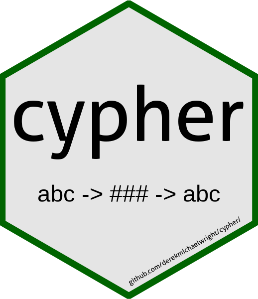

```{r setup, include = FALSE}
knitr::opts_chunk$set(echo = T)
```

`cypher`: an R package for coding and decoding secret messages



---

# Installation

```{r eval = F}
devtools::install_github("derekmichaelwright/cypher")
```

```{r}
library(cypher)
```

---

# Code Message

```{r}
xx <- cypher_code("This is a secret coded message")
xx
```

# Decoded Message

```{r}
cypher_decode(xx)
```

---

# Shiny App

Download and run the following `R` script:

https://github.com/derekmichaelwright/cypher/blob/master/shinyapp/app.R

---

# Personalize

A custom cypher for this package can be recreated using the following code. However, it should be noted that the recipient will need the `Data/cyphers.RData` file to decode the messages.

```{r eval = F}
cyphers <- list()
for(i in 1:999) {
  cyphers[i] <- paste(round(runif(1000, 0, 9)),collapse = "")
}
save(cyphers, file = "Data/cyphers.RData")
```

---

# How it works

This package uses a Caesar cypher in which each letter gets a different shift. Additionally, each message gets a different set of shifts based on the 3 number code at the start of the message. The first 3 numbers indicate which cypher will be used, and indicates the shift used for every character. then the utf8 codes are converted to integers and the caesar shift is added. For decoding, the first 3 numbers are read and used to find the correct cypher, then the integers are shifted, allowing the integers to be converted back to utf8 coding.

---

# R Script/Functions

```{r}
cypher_code <- function(x) {
  cn <- round(runif(1, 1, 999))
  x <- paste(c(as.numeric(stringr::str_pad(cn, 3, pad = "0")), utf8ToInt(x) + utf8ToInt(substr(cyphers[cn], 1, nchar(x)))), collapse = " ")
  x
}
```

```{r}
cypher_decode <- function(x) {
  x <- as.numeric(unlist(strsplit(x, split = " ")))
  cn <- x[1]
  intToUtf8(x[2:length(x)] - utf8ToInt(substr(cyphers[cn], 1, length(x)-1)))
}
```

---

&copy; Derek Michael Wright