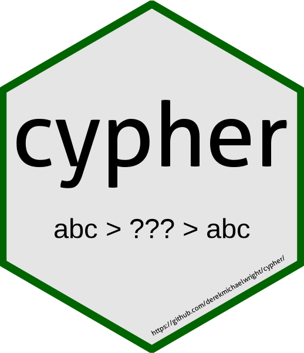

cypher
================

`cypher`: an `R` package for coding and decoding secret messages

# Installation

``` r
devtools::install_github("derekmichaelwright/cypher")
```

``` r
library(cypher)
```



# Code Message

``` r
xx <- cypher_code("This is a secret coded message")
xx
```

    ## [1] "708 132 156 158 167 81 157 168 83 146 83 165 156 150 163 154 171 83 151 162 151 151 151 87 159 152 172 169 151 156 151"

# Decoded Message

``` r
cypher_decode(xx)
```

    ## [1] "This is a secret coded message"

# Shiny App

Download and run the following `R` script:

<a href="https://github.com/derekmichaelwright/cypher/blob/master/shinyapp/app.R">
<button class="btn btn-success"><i class="far fa-file-code"></i> https://github.com/derekmichaelwright/cypher/blob/master/shinyapp/app.R</button>
</a>

# Personalize

A custom cypher for this package can be recreated using the following
code. However, it should be noted that the recipient will need the
`Data/cyphers.RData` file to decode the messages.

``` r
cyphers <- list()
for(i in 1:999) {
  cyphers[i] <- paste(round(runif(1000, 0, 9)),collapse = "")
}
save(cyphers, file = "Data/cyphers.RData")
```

------------------------------------------------------------------------

© Derek Michael Wright [www.dblogr.com/](https://dblogr.com/)
